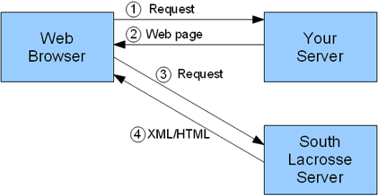

# SEMLA REST Examples

This project shows how to include data such as league tables and fixtures from the South Lacrosse site within your own web pages, or use it for any other kind of processing.

You can access [Fixtures](Fixtures.md) or [Tables](Tables.md). See also [Running The Examples](#running-the-examples) and [Error Codes](Errors.md).

If you have any trouble using these services please email Dave Slaughter at [webmaster@southlacrosse.org.uk](mailto:webmaster@southlacrosse.org.uk). And thanks to Dan Scott for suggesting the idea.

If you use these services please credit where you got the data from with a link back to the South Lacrosse site, for example:

Data provided by [southlacrosse.org.uk](http://www.southlacrosse.org.uk/)

The HTML markup is as follows:

```html
<p><small>Data provided by <a href="http://www.southlacrosse.org.uk/">southlacrosse.org.uk</a></small></p>
```

## Background

Data from the South Lacrosse site is made available via REST services. If you don't know what REST is, don't worry - you don't need to be familiar with it to use these services. REST is an architectural style, not a standard, and is based on standard Web technologies. This means it should be relatively simple to use, even for novice web programmers. If you want to read up on it you might want to see the [REST page at Wikipedia](https://en.wikipedia.org/wiki/Representational_State_Transfer).

## Running The Examples

Simply clone this repository or download the zip file, then copy the `examples` folder to your web server. To run the PHP examples you will need PHP with the curl extension installed (this is usually compiled in, so if your site has PHP it is very unlikely not to have curl).

You can also run the Client Side Includes example by simply opening the `client-side-include-tables.html` file directly in a browser on your computer.

## How it Works

We publish resources at specified URIs, and currently data is available in both XML and HTML formats. The default format is XML, which is returned if the extension is omitted or `xml`, and gives the maximum flexibility for processing on the client. HTML is returned if the extension is `html`, and is the the easiest format to include in another web page.

For example the league tables are at [www.southlacrosse.org.uk/rest/tables/mens](http://www.southlacrosse.org.uk/rest/tables/mens) for the default XML format, or at [www.southlacrosse.org.uk/rest/tables/mens.html](http://www.southlacrosse.org.uk/rest/tables/mens.html) for an HTML version.

**Please note:** for historic reasons many resources have `mens` as part of the URI. This is because the site originally contained data for both men's and women's leagues.

Clients (which can be other servers, web browsers, or any other computer program) can then access that resource using a simple web request, and process it in any way they wish, which in most cases will be to include the formatted data within another web page.

Clients will typically use these resources to build part of a web page on a different site, using either [Server Side Includes (SSI)](#server-side-includes-ssi) or [Client Side Includes (CSI)](#client-side-includes-csi).

### HTML or XML

If you are just going to include our data in your own web page then the simplest way is to use the HTML format, and include the resource directly in your page. In order to see how the HTML is formatted you can simply enter the resource URI into a web browser to view the page output, and "view source" to see the exact HTML. You can then style the output using CSS (if required, surround the included HTML with a `<div>` tag with an `id` or `class` to reference it directly).

If you want to provide your own HTML formatting, or for more complicated processing, then using the XML format will be best.

### Server Side Includes (SSI)

SSI is the recommended way to include our data in your own web pages. A typical interaction is detailed below:


1.  The user requests a page from your site
2.  Your server requests the league table data from the South Lacrosse server
3.  The South Lacrosse server returns the data in the requested format
4.  Your server includes the league table within your page, and returns this amalgamated page to the user

In order to speed up access to your web page, the data is usually cached on your own server, and only retrieved if the local copy is over a predefined age - say 2 hours. This means most times only actions 1\. and 4\. occur. Additionally it makes you a good neighbour, by cutting down on the processing and bandwidth used by the South Lacrosse site.

Sample code of how to do this is in the [examples folder](examples).

### Client Side Includes (CSI)

If at all possible, it is recommended to use [Server Side Includes](#server-side-includes-ssi), the main reasons being:

*   Browsers may not have Javascript enabled, either because the device does not support it, or because the user has turned it off for security reasons, etc.
*   Search engines can't see content that is added with Javascript, so the included part of your page won't be indexed.

However, if you have no other way of including data from our site, then CSI can come to the rescue. A typical interaction is detailed below:



1.  The user requests a page from your site
2.  Your server returns the page to the browser (minus the league table)
3.  Javascript runs in the web browser, and requests the league tables from the South Lacrosse server
4.  The South Lacrosse server returns the league tables, which are then inserted into the web page

You can use your own scripts to include our resources, or we provide Javascript for you to use, as detailed below. A complete working example is available in the [examples folder](examples).

In your page `<body>` create a `<div>` tag as follows in the location you want the data included:

```html
<div id="sl">Loading...
<noscript>
<p><b>Javascript must be enabled in order for this page to work correctly.</b></p>
<p>However, it seems Javascript is either disabled or not supported by your browser. To view the data
enable Javascript by changing your browser options, and then try again.</p>
</noscript>
</div>
```

The `id` must be unique within your page, and may be any value, but it must match up to the call to `clientSideInclude` which we are just about to add. If you are going to include more than one resource then add a separate `<div>` tag for each resource (making sure you have a different `id` for each one).

To load the South Lacrosse data into the `div` you must load the client side include Javascript, and call `clientSideInclude` to fetch the data, passing the `id` of the `div` you want the data to be loaded into, and the URI of the resource. This should be added just before the closing `</body>` tag as follows:

```html
<script src="http://www.southlacrosse.org.uk/js/clientSideInclude.js"></script>
<script>
clientSideInclude('sl', 'http://www.southlacrosse.org.uk/rest/tables/mens/Prem.html');
</script>
</body>
```

If you are loading more than one resource then you will need to call `clientSideInclude` multiple times.
